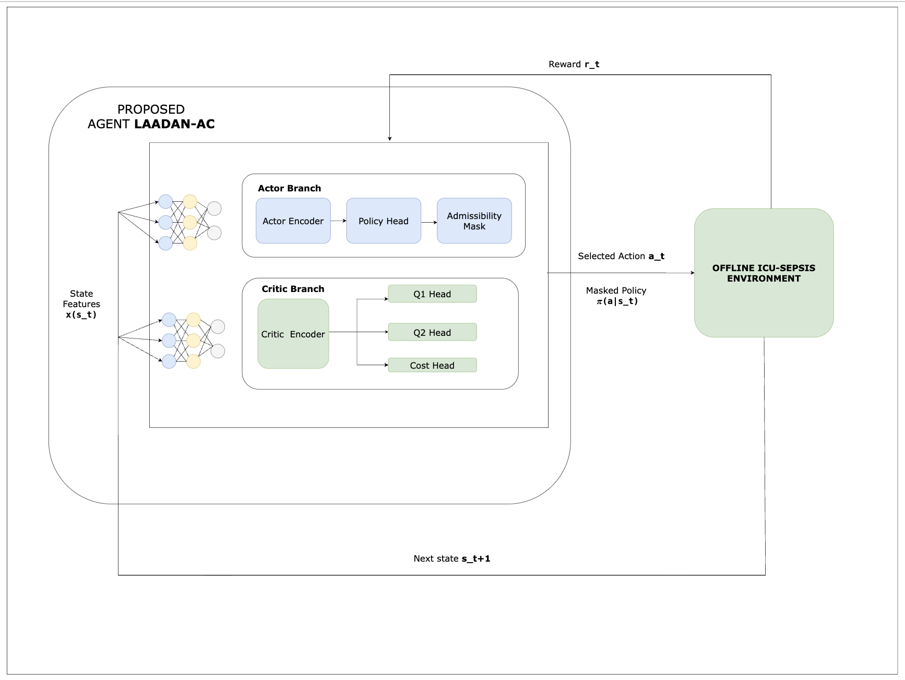
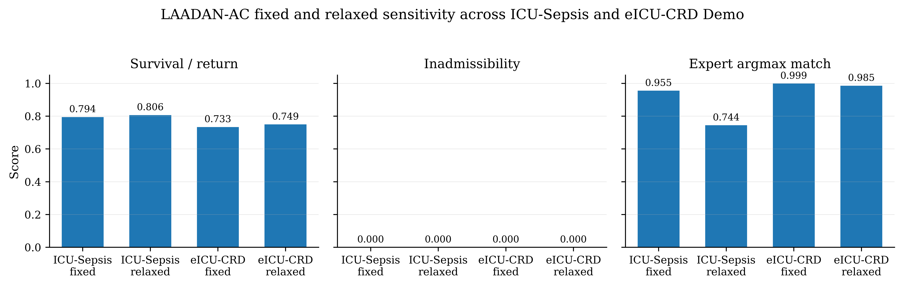
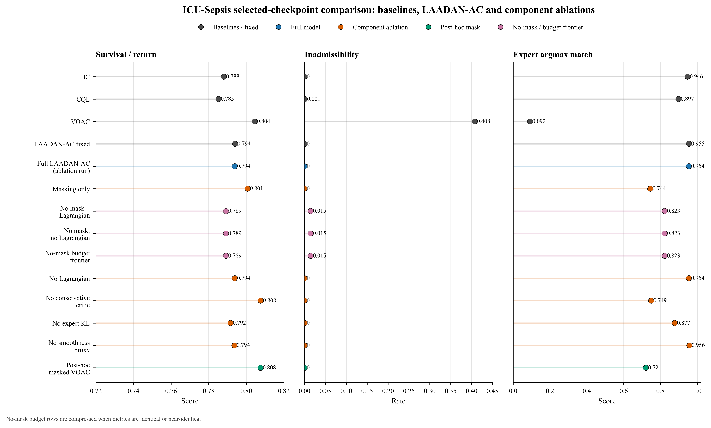
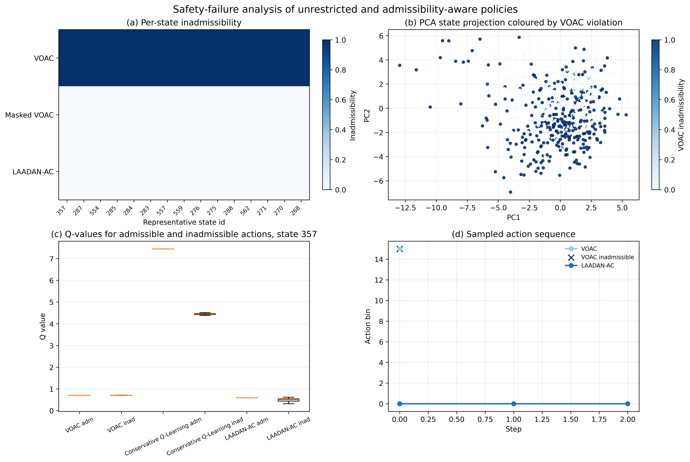

<a id="top"></a>

<div align="center">

# LAADAN-AC

**Beyond Survival in Admissible Offline Treatment-Policy Learning**

[](LICENSE)


[**Riya Basak**](https://github.com/AnnyaB), [**Manal Helal**](https://github.com/mhelal)

[Code](https://github.com/AnnyaB/laadan-ac) • [Overview](#overview) • [Main Findings](#main-findings) • [Appendix C Experiment](#appendix-c-experiment) • [Installation](#installation) • [Data](#data) • [Usage](#usage) • [Citation](#citation)


</div>

---

## Overview

**LAADAN-AC** is a research codebase for admissibility-aware offline reinforcement learning in sepsis treatment-policy benchmarks.

The project studies a central failure mode in offline treatment-policy learning: a policy may obtain a high estimated survival or return while selecting actions that are weakly supported or inadmissible under the benchmark action mask.

We introduce **Lagrangian Admissibility-Aware Deep Action-Nudging Actor-Critic (LAADAN-AC)**, an offline actor-critic framework that combines:

* hard admissibility masking,
* twin reward critics,
* conservative critic regularisation,
* expert-policy regularisation,
* a state-action smoothness proxy,
* and Lagrangian cost control.

The method is evaluated on the **ICU-Sepsis** benchmark and on a constructed **eICU-CRD Demo** Markov decision process used as a cross-source portability check.

<p align="center">
  
</p>

---

## Abstract

*Offline reinforcement learning* offers a way to study *sepsis* treatment policies without online patient experimentation, but high estimated survival can be misleading when a policy selects poorly supported or inadmissible actions.

*LAADAN-AC* introduces an admissibility-aware offline actor-critic framework that learns within a benchmark-defined admissible action interface. The framework combines hard action masking, twin reward critics, conservative critic regularisation, expert-policy regularisation, a state-action smoothness proxy, and a constrained Markov decision process (CMDP) adaptive cost-control term based on Lagrangian relaxation.

The framework is evaluated on the *ICU-Sepsis benchmark* using five random seeds and exact finite-horizon Markov decision process (MDP) evaluation, then tested for portability on a constructed *eICU Collaborative Research Database Demo* MDP.

The repository also includes relaxed-model experiments, component ablations, no-mask cost-control analyses, Appendix C PD/RC diagnostics, and safety-failure analyses. Together, these experiments examine not only estimated return, but also selected-action admissibility, expert alignment, and policy behaviour near or outside the benchmark admissible set.

The results support the interpretation that hard masking provides the direct selected-action admissibility guarantee, while conservative regularisation, expert-guided policy shaping, and adaptive cost-control terms influence how the policy behaves within or near the admissible action interface. This repository provides a reproducible benchmark framework for evaluating return, admissibility, and expert alignment together.


---

## Main Findings

| Experiment                      | Finding                                                                                                                                             |
| ------------------------------- | --------------------------------------------------------------------------------------------------------------------------------------------------- |
| ICU-Sepsis main comparison      | LAADAN-AC achieves zero selected-action inadmissibility and the strongest expert argmax agreement among the main methods.                           |
| VOAC comparison                 | Vanilla Offline Actor-Critic reaches higher return but selects inadmissible actions at a high rate.                                                 |
| Relaxed LAADAN-AC               | Lower soft regularisation improves selected-checkpoint return on ICU-Sepsis and eICU-CRD Demo while retaining zero inadmissibility.                 |
| eICU-CRD Demo portability check | The same pipeline can be reused under a shifted MDP when transition dynamics, expert policy, and admissibility masks are available.                 |
| Component ablation              | Hard masking provides the direct admissibility guarantee; conservative and expert-guided regularisation shape the policy within the admissible set. |
| No-mask Lagrangian frontier     | Lagrangian cost control alone does not replace masked admissible action selection in this benchmark. |
| Appendix C no-mask PD/RC diagnostic | A separate no-mask PD/RC diagnostic tests adaptive primal-dual cost pressure, robust cost-aware scoring, and certified action selection when the original hard action mask is removed. |
| Safety-failure analysis         | VOAC's return advantage is associated with unsupported action selection at state, action, value, and trajectory levels.                             |

> **Note**
> In the current benchmark implementation, hard admissibility masking is the direct mechanism that guarantees zero selected-action inadmissibility. The CMDP/Lagrangian cost-control component is retained as part of the tested framework and ablation study, but the present results show that it is secondary to hard masking rather than a replacement for it.

<p align="center">
  
</p>

---

## Appendix C Experiment

An additional no-mask PD/RC diagnostic is included in appendix c experiment. 

This appendix experiment tests whether adaptive Lagrangian cost control remains informative when the original hard admissibility mask is removed from actor optimisation. It separates primal-dual cost pressure, robust risk-adjusted action scoring, and deterministic certified action selection.

The Appendix C experiment is auxiliary: it does not replace the main masked LAADAN-AC result. It supports the interpretation that reliable selected-action admissibility requires an explicit feasible-action mechanism, either hard masking or cost-checked action selection.

See the full reproducibility notes, code layout, and saved outputs in [`appendix_c_experiment/README.md`](appendix_c_experiment/README.md).

---

## Repository Structure

```text
laadan-ac/
├── README.md
├── LICENSE
├── CODE_OF_CONDUCT.md
├── requirements.txt
├── .gitignore
├── assets/
│   ├── architecture_diagram.png
│   ├── cross_domain_portability.png
│   ├── component_ablation.png
│   └── safety_failure_analysis.png
├── data/
│   ├── icu_sepsis/
│   │   ├── expertPolicy.csv
│   │   ├── initialStateDistribution.csv
│   │   ├── rewardFunction.csv
│   │   ├── transitionFunction.csv
│   │   └── extras/
│   │       ├── admissibleActions.txt
│   │       ├── sofaScores.csv
│   │       └── stateClusterCenters.csv
│   └── eicu_demo_mdp/
│       ├── admissibleActions.txt
│       ├── expertPolicy.csv
│       ├── initialStateDistribution.csv
│       ├── rewardFunction.csv
│       ├── transitionFunction.csv
│       └── extras/
│           ├── action_names.json
│           ├── build_summary.csv
│           ├── eicu_demo_mdp_description.json
│           └── stateClusterCenters.csv
├── scripts/
│   ├── benchmark.py
│   ├── build_eicu_demo_mdp.py
│   ├── models.py
│   ├── trainers.py
│   ├── run_experiments.py
│   ├── pick_final_models.py
│   ├── test_final_models.py
│   ├── lagrangian_frontier.py
│   ├── safety_failure_analysis.py
│   └── plots.py
├── appendix_c_experiment/
│   ├── README.md
│   ├── code/
│   │   ├── models.py
│   │   ├── trainers.py
│   │   ├── run_experiments.py
│   │   ├── pick_final_models.py
│   │   ├── test_final_models.py
│   │   ├── run_rc_ablations.py
│   │   ├── test_rc_ablation_models.py
│   │   ├── plot_rc_ablations.py
│   │   └── select_appendix_c_final_models.py
│   └── results/
│       ├── icu_sepsis_LAADAN_AC_PD/
│       ├── eicu_LAADAN_AC_PD/
│       ├── icu_rc_ablations/
│       └── eicu_rc_ablations/
└── results/
    ├── icu_sepsis_main/
    ├── icu_sepsis_relaxed/
    ├── eicu_demo_main/
    ├── eicu_demo_relaxed/
    ├── lagrangian_frontier/
    └── safety_failure_analysis/
```

---

## Installation

Create a Python environment and install the dependencies:

```bash
python -m venv .venv
source .venv/bin/activate

pip install --upgrade pip
pip install -r requirements.txt
```

Check that the main scripts compile:

```bash
python -m py_compile scripts/*.py
```

---

## Reproducibility Environment

The released experiments were run in a Kaggle GPU notebook environment with the following recorded software and hardware setup:

```text
NumPy: 2.0.2
PyTorch: 2.10.0+cu128
CUDA available: True
GPU: Tesla T4
```

Small numerical differences *may* occur if the experiments are rerun under a *different* PyTorch, CUDA, GPU, or CPU environment.

---

## Data

This repository contains the two processed Markov decision process folders used in the released experiments.

### ICU-Sepsis Benchmark

The main experiment uses the released ICU-Sepsis benchmark Markov decision process. The expected files are:

```text
data/icu_sepsis/
├── expertPolicy.csv
├── initialStateDistribution.csv
├── rewardFunction.csv
├── transitionFunction.csv
└── extras/
    ├── admissibleActions.txt
    ├── sofaScores.csv
    └── stateClusterCenters.csv
```

### eICU-CRD Demo MDP

The cross-source portability check uses the constructed eICU-CRD Demo Markov decision process included in this repository. The expected files are:

```text
data/eicu_demo_mdp/
├── admissibleActions.txt
├── expertPolicy.csv
├── initialStateDistribution.csv
├── rewardFunction.csv
├── transitionFunction.csv
└── extras/
    ├── action_names.json
    ├── build_summary.csv
    ├── eicu_demo_mdp_description.json
    └── stateClusterCenters.csv
```

The released experiments use the processed `data/eicu_demo_mdp/` files above.

---

## Usage

The repository is organised around the final experiments and outputs used in the manuscript. The `results/` folder contains training histories, metric files, selected checkpoints, and diagnostic outputs for:

```text
results/icu_sepsis_main/
results/icu_sepsis_relaxed/
results/eicu_demo_main/
results/eicu_demo_relaxed/
results/lagrangian_frontier/
results/safety_failure_analysis/
```

### Main Scripts

| Script                               | Purpose                                                                                                      |
| ------------------------------------ | ------------------------------------------------------------------------------------------------------------ |
| `scripts/benchmark.py`               | Loads tabular Markov decision process files and performs exact finite-horizon evaluation.                    |
| `scripts/models.py`                  | Defines Behaviour Cloning, Conservative Q and actor-critic networks.                                         |
| `scripts/trainers.py`                | Implements Behaviour Cloning, CQL-regularised fitted-Q, Vanilla Offline Actor-Critic and LAADAN-AC training. |
| `scripts/run_experiments.py`         | Runs the main training and evaluation pipeline.                                                              |
| `scripts/pick_final_models.py`       | Selects final checkpoints from completed runs.                                                               |
| `scripts/test_final_models.py`       | Reloads selected checkpoints and recomputes final metrics.                                                   |
| `scripts/lagrangian_frontier.py`     | Runs component ablations and no-mask Lagrangian frontier experiments.                                        |
| `scripts/safety_failure_analysis.py` | Generates state-, action-, value- and trajectory-level safety diagnostics.                                   |
| `scripts/build_eicu_demo_mdp.py`     | Documents the construction of the eICU-CRD Demo Markov decision process.                                     |
| `scripts/plots.py`                   | Shared plotting utilities used by experiment scripts.                                                        |

---

## Example Commands

### Run the main ICU-Sepsis experiment

```bash
DATA_DIR="data/icu_sepsis"

python -u scripts/run_experiments.py \
  --data-dir "$DATA_DIR" \
  --results-dir results/icu_sepsis_main \
  --device auto
```

### Select and verify the final ICU-Sepsis checkpoints

```bash
python -u scripts/pick_final_models.py \
  --results-dir results/icu_sepsis_main

python -u scripts/test_final_models.py \
  --data-dir "$DATA_DIR" \
  --final-models-dir results/icu_sepsis_main/final_models \
  --config-path results/icu_sepsis_main/run_config.json \
  --device auto \
  --horizon 50 \
  --output-json results/icu_sepsis_main/final_models/test_summary.json
```

### Run the same pipeline on the processed eICU-CRD Demo MDP

```bash
DATA_DIR="data/eicu_demo_mdp"

python -u scripts/run_experiments.py \
  --data-dir "$DATA_DIR" \
  --results-dir results/eicu_demo_main \
  --device auto

python -u scripts/pick_final_models.py \
  --results-dir results/eicu_demo_main

python -u scripts/test_final_models.py \
  --data-dir "$DATA_DIR" \
  --final-models-dir results/eicu_demo_main/final_models \
  --config-path results/eicu_demo_main/run_config.json \
  --device auto \
  --horizon 50 \
  --output-json results/eicu_demo_main/final_models/test_summary.json
```

### Run the component-ablation and no-mask Lagrangian frontier analysis

```bash
python -u scripts/lagrangian_frontier.py \
  --data-dir data/icu_sepsis \
  --results-dir results/lagrangian_frontier \
  --device auto
```

### Run the safety-failure diagnostics from the selected ICU-Sepsis checkpoints

```bash
python -u scripts/safety_failure_analysis.py \
  --data-dir data/icu_sepsis \
  --final-models-dir results/icu_sepsis_main/final_models \
  --config-path results/icu_sepsis_main/run_config.json \
  --output-dir results/safety_failure_analysis \
  --device auto
```

### Inspect command-line options

Use `--help` to inspect the available command-line options for each script:

```bash
python scripts/run_experiments.py --help
python scripts/pick_final_models.py --help
python scripts/test_final_models.py --help
python scripts/lagrangian_frontier.py --help
python scripts/safety_failure_analysis.py --help
```

---

## Saved Checkpoints

The released `results/` folders include `.pt` checkpoint files for the trained models. These checkpoint files are stored with Git LFS.

Before cloning the repository, install Git LFS:

```bash
git lfs install
git clone https://github.com/AnnyaB/laadan-ac.git
cd laadan-ac
git lfs pull
```

Including checkpoints allows the final metrics and safety-failure diagnostics to be reloaded directly from the repository.

---

## Figures

The README uses four summary figures stored in `assets/`:

```text
assets/architecture_diagram.png
assets/cross_domain_portability.png
assets/component_ablation.png
assets/safety_failure_analysis.png
```

These figures summarise the architecture, cross-domain portability check, component ablation and safety-failure analysis. The reproducibility record is stored in the corresponding data, script and result folders.

<p align="center">
  
</p>

<p align="center">
  
</p>

---

## Important

> This repository is a **benchmark research implementation**.
> It is **not** a clinical decision-support system and must not be used to guide patient treatment.
> The experiments evaluate return, admissibility, and expert alignment under **fixed benchmark Markov decision processes**.

---

## Citation

If you use this repository, code, saved checkpoints, experiment scripts, or LAADAN-AC implementation, please cite:

```bibtex
@misc{basak2026laadanac,
  author       = {Basak, Riya and Helal, Manal},
  title        = {{LAADAN-AC}: Beyond Survival in Admissible Offline Treatment-Policy Learning},
  year         = {2026},
  month        = jun,
  url          = {https://github.com/AnnyaB/laadan-ac}
}
```

The accompanying manuscript was submitted to ICaTAS 2026 in June 2026. Until acceptance or publication, please cite the repository as research software.

---

## Contact and Contributions

For questions, reproducibility issues, or suggested improvements, please open a GitHub issue.

---

<div align="center">

**[Back to top](#top)**

</div>

