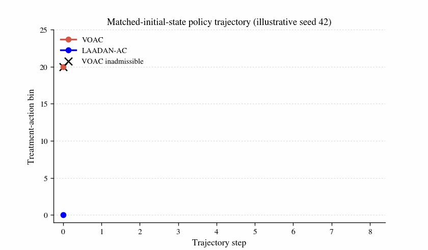
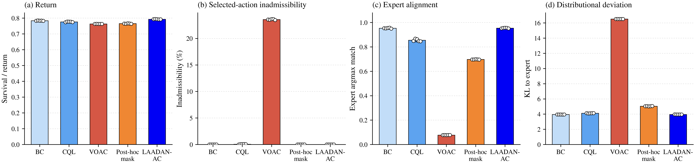
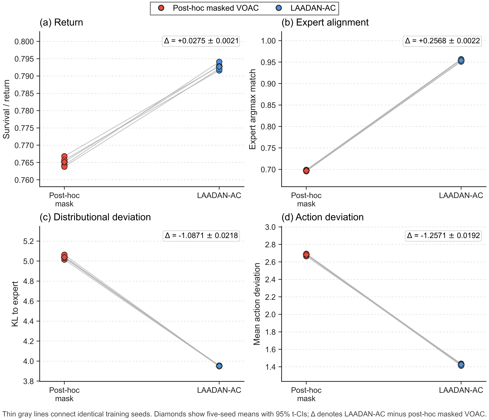
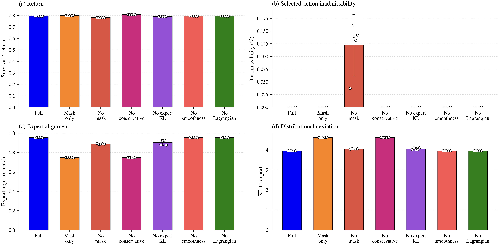
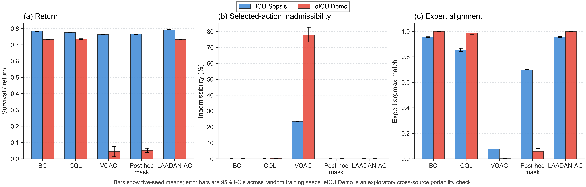

<div align="center">

# LAADAN-AC
### Beyond Survival in Admissible Offline Treatment-Policy Learning

[Riya Basak](https://github.com/AnnyaB), [Manal Helal](https://github.com/mhelal)

**Accepted to ICaTAS 2026**

<p align="center">
  <b>[ <a href="results/fixed_schedule_2026">Results &amp; Checkpoints</a> | <a href="data">Data</a> ]</b>
</p>

</div>

<br>

<p align="center">
  
</p>

<p align="center"><sub>Illustrative trajectory from the predeclared seed 42. Quantitative results use all five training seeds.</sub></p>

## Abstract

What does it mean for an offline treatment policy to be reliable? Contemporary offline reinforcement-learning studies often summarize policy quality through expected return, yet high return alone does not reveal whether selected actions remain within a benchmark-defined admissible set or preserve alignment with expert behaviour. We study this gap through **Lagrangian Admissibility-Aware Deep Action-Nudging Actor-Critic (LAADAN-AC)**, an admissibility-constrained offline actor-critic framework that places the feasible-action interface directly inside policy learning. We instantiate this framework with hard action masking, twin reward critics, conservative critic regularisation, expert-policy KL shaping, a state-action smoothness proxy, and Lagrangian cost pressure. In LAADAN-AC, the hard mask restricts policy support to admissible actions, while the remaining terms shape how the policy trades return and expert alignment within that interface. The contribution therefore lies in the admissibility-aware actor interface, its integration with these established components, and the resulting empirical analysis rather than in any single regulariser in isolation.

We evaluate all headline models at a predetermined epoch-1000 checkpoint across five random training seeds (42–46), without using the benchmark evaluator for checkpoint selection, early stopping, seed selection, or hyperparameter adaptation. On ICU-Sepsis, LAADAN-AC achieves **0.7927 ± 0.0012** return, **0.0000%** selected-action inadmissibility, and **0.9540 ± 0.0032** expert argmax agreement. In a paired five-seed comparison with post-hoc masked VOAC, training under the admissibility interface improves return by **+0.0275 ± 0.0021** and expert agreement by **+0.2568 ± 0.0022**, while both policies remain admissible after masking. Component ablations further show that the hard mask is the direct mechanism enforcing zero selected-action inadmissibility, whereas the other terms primarily shape the return–alignment operating point. We also test the same framework on a constructed eICU-CRD Demo MDP as an exploratory cross-source portability study. Together, these results show how admissibility, return, and expert alignment can be evaluated as distinct but coupled properties of offline treatment-policy learning.

## Overview

<p align="center">
  
</p>

LAADAN-AC is an admissibility-constrained offline actor-critic framework for tabular treatment-policy benchmarks. The actor is restricted to benchmark-admissible actions during training and action extraction. Conservative critic regularisation, expert-policy KL, smoothness, and Lagrangian cost pressure then shape behaviour within or around that admissible interface.

The released evaluation focuses on three quantities together:

- **Return** under exact finite-horizon benchmark evaluation.
- **Selected-action admissibility** under the benchmark action mask.
- **Expert alignment**, measured by expert argmax agreement and distributional deviation.

The benchmark admissibility signal is a property of the *released MDP interface*; it should **not** be interpreted as a clinical safety guarantee or treatment-optimality claim.

## Results

All values below are means ± **95% t-CI across five random training seeds**. These intervals quantify variability across training initialisations.

| Method | Return | Inadmissibility (%) | Expert argmax match | KL to expert |
|---|---:|---:|---:|---:|
| Behavior Cloning | 0.7834 ± 0.0013 | 0.0000 | 0.9533 ± 0.0038 | 3.9481 ± 0.0038 |
| CQL-regularised fitted-Q | 0.7761 ± 0.0024 | 0.0547 ± 0.0394 | 0.8545 ± 0.0126 | 4.1120 ± 0.0204 |
| Vanilla Offline Actor-Critic | 0.7632 ± 0.0002 | 23.5677 ± 0.0904 | 0.0774 ± 0.0002 | 16.5103 ± 0.0014 |
| Post-hoc Masked VOAC | 0.7652 ± 0.0015 | 0.0000 | 0.6972 ± 0.0014 | 5.0386 ± 0.0218 |
| **LAADAN-AC** | **0.7927 ± 0.0012** | **0.0000** | **0.9540 ± 0.0032** | **3.9515 ± 0.0033** |

Within the five-method main comparison, LAADAN-AC combines the highest return with zero benchmark-defined selected-action inadmissibility and expert agreement comparable to Behavior Cloning.

<p align="center">
  
</p>

### Training under the admissibility interface

Post-hoc masking and LAADAN-AC both produce zero selected-action inadmissibility after masking, but the paired fixed-schedule comparison separates action-time masking from training under the admissibility interface. Across the same five seeds, LAADAN-AC improves return by **0.0275 ± 0.0021**, expert argmax agreement by **0.2568 ± 0.0022**, and KL to the expert by **−1.0871 ± 0.0218** relative to post-hoc masked VOAC.

<p align="center">
  
</p>

### Component ablation

The ablations make the roles of the individual terms explicit. The masking-only actor-critic reaches **0.7974 ± 0.0026** return with zero inadmissibility but **0.7488 ± 0.0035** expert agreement. Removing the conservative critic increases return to **0.8067 ± 0.0009**, again with zero inadmissibility, while expert agreement falls to **0.7473 ± 0.0025**. The full objective therefore should not be read as a return-maximising variant: it selects a different return–admissibility–alignment operating point. Removing the action mask produces non-zero inadmissibility, confirming that the *mask* is the direct feasibility mechanism in the reported benchmark.

<p align="center">
  
</p>

### Cross-source portability

The constructed eICU-CRD Demo MDP is used as an exploratory portability check. It contains 202 states, 25 actions, and 22-dimensional state features, compared with 716 states, 25 actions, and 47-dimensional features in ICU-Sepsis. On this MDP, LAADAN-AC obtains **0.7329 ± 0.0008** return, zero selected-action inadmissibility, and **0.9984 ± 0.0006** expert argmax agreement.

<p align="center">
  
</p>

## Using the code

### Installation

```bash
git lfs install
git clone https://github.com/AnnyaB/laadan-ac.git
cd laadan-ac
git lfs pull

python -m venv .venv
source .venv/bin/activate
python -m pip install --upgrade pip
python -m pip install -r requirements.txt
```

The experiments were run with Python 3.12.13, NumPy 2.0.2, PyTorch 2.10.0+cu128, CUDA 12.8, and 2× Tesla T4 GPUs. Per-run environment and provenance records are stored with the fixed-schedule results.

### Data

The repository includes the processed MDP files used by the released experiments.

| Dataset | States | Actions | Feature dim. | Role |
|---|---:|---:|---:|---|
| ICU-Sepsis | 716 | 25 | 47 | Main benchmark |
| eICU-CRD Demo MDP | 202 | 25 | 22 | Exploratory cross-source portability |

Both benchmarks use a finite evaluation horizon of 50. Input hashes are recorded in each fixed-schedule result directory and checked by the validator.

### Fixed-schedule experiments

The final protocol uses seeds `42,43,44,45,46` and the predetermined epoch-1000 checkpoint. To reproduce the main ICU-Sepsis and eICU runs without duplicate ablation training:

```bash
python scripts/run_fixed_schedule.py \
  --datasets both \
  --icu-ablations none \
  --eicu-ablations none \
  --device auto
```

Run the six ICU perturbation ablations separately. The aggregate builder reuses the main LAADAN-AC checkpoints as the full-model row rather than retraining them:

```bash
python scripts/run_fixed_schedule_ablations.py \
  --data-dir data/icu_sepsis \
  --output-root results/fixed_schedule_2026/icu_sepsis \
  --variants mask_only,no_conservative,no_expert_kl,no_smoothness,no_lagrangian,no_mask \
  --device auto
```

This produces the 70 trained checkpoints in the fixed camera-ready archive: 20 ICU main checkpoints, 20 eICU main checkpoints, and 30 ICU perturbation-ablation checkpoints. Post-hoc masked VOAC is evaluation-only and does not train an additional model.

### Safety diagnostics

The quantitative diagnostics use all five fixed epoch-1000 seeds. Qualitative state, Q-value, and trajectory panels use the predeclared illustrative seed 42.

```bash
python scripts/run_fixed_schedule_safety_diagnostics.py \
  --data-dir data/icu_sepsis \
  --results-root results/fixed_schedule_2026/icu_sepsis \
  --output-dir results/fixed_schedule_2026/icu_sepsis/safety_diagnostics \
  --illustrative-seed 42 \
  --device auto
```

### Validation

```bash
python scripts/validate_fixed_schedule_results.py \
  --root results/fixed_schedule_2026/icu_sepsis \
  --data-dir data/icu_sepsis \
  --ablations full \
  --skip-figures

python scripts/validate_fixed_schedule_results.py \
  --root results/fixed_schedule_2026/eicu_demo \
  --data-dir data/eicu_demo_mdp \
  --ablations none \
  --skip-figures

python -m pytest -q tests
```

## Checkpoints and provenance

The evidence is under [`results/fixed_schedule_2026/`](results/fixed_schedule_2026/). Each trained seed directory contains the saved model, training history, final metrics, and provenance where applicable. The release records the checkpoint rule, evaluated epoch, environment, and input-data hashes needed to audit the reported results.

Previous experiments are retained under `results/archive/blind_review/` and `archive/blind_review/` for provenance.

## Citation

```bibtex
@misc{basak2026laadanac,
  author       = {Basak, Riya and Helal, Manal},
  title        = {{LAADAN-AC}: Beyond Survival in Admissible Offline Treatment-Policy Learning},
  year         = {2026},
  month        = jun,
  url          = {https://github.com/AnnyaB/laadan-ac}
}
```

The citation metadata is also available in [`CITATION.bib`](CITATION.bib) and [`CITATION.cff`](CITATION.cff).


## Contact

For questions about the code or reproducibility, please open a GitHub issue.
